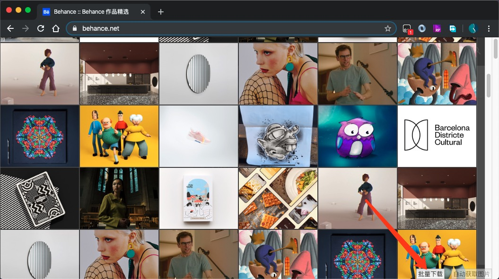

# 油猴插件

自制的一些常用的工具。[油猴地址](https://greasyfork.org/zh-CN/users/226081-yujinpan)

> （如果有其他的需求或者问题，欢迎提出～）

## 电影天堂系列网站去掉广告与高亮高分电影

### 主要功能

- 去掉第一次进入点击页面弹出的广告
- 标记高分电影
- 去掉搜索框第一次输入弹出广告
- 去掉页面上的 flash 广告（还可以提高网站性能），不影响页面布局
- 去掉右下角的 flash 广告
- 去掉按任意键弹出广告
- 去掉首次点击任何地方弹出广告

### 适用站点

- [www.dytt8.net](https://www.dytt8.net)
- [www.ygdy8.com](https://www.ygdy8.com)
- [www.dy2018.com](https://www.dy2018.com)
- [www.xiaopian.com](https://www.xiaopian.com)
- [www.dygod.net](https://www.dygod.net)

### 更新记录

2019/2/28 新增：

- 增加“去掉首次点击任何地方弹出广告”新功能

2019/2/25 新增：

- 增加“去掉按任意键弹出广告”新功能

2019/2/23 修改：

- 解决“暴力猴”类扩展不支持 http 与 https 同时匹配问题

2019/1/31 新增：

- 增加 [电影天堂 dy2018](https://www.dy2018.com) 网站匹配
- 增加 [小片/小调网 xiaopian](https://www.xiaopian.com) 网站匹配
- 增加 [电影天堂 dygod](https://www.dygod.net) 网站匹配

2018/11/26 新增:

- 增加 [阳光电影](https://www.ygdy8.com) 的网站匹配

2018/11/16 新增：

- 去掉页面上的 flash 广告（还可以提高网站性能），不影响页面布局
- 去掉右下角的 flash 广告

## 新浪股票 API 数据实时展示

### 主要功能

- 分时图/日K图
- 【名】【当前价格】【当前涨幅】实时的展示在浏览器的标签上（嘿嘿）
- 页面上增加详细的开盘，收盘，最高，最低等价格
- 页面上增加搜索跳转方便查看其他股票
- 数据 3 秒更新一次

### 适用站点

- [hq.sinajs.cn](https://hq.sinajs.cn/list=sh000001)

## 网站图片（背景图，svg，canvas）抓取预览下载

### 主要功能

- 【图片尺寸过滤】过滤小图片
- 【批量下载功能】一键打包下载全部图片
- 抓取页面上的图片链接，包括 **img，背景图，svg，canvas**
- 提供展示抓取的图片的列表快速预览
- 提供按钮快速切换抓取的图片展示区
- 提供快速下载，点击预览即可下载源图片文件
- 提供动态抓取后来加载的图片

### 适用站点

- 所有站点

### 更新记录

2020-3-30 更新：
- 新增对【图片尺寸过滤】设置的记住功能
- 优化查询速度

2020/1/12 更新：
- 新增【图片尺寸过滤】功能
- 修复会出现重复的情况

2019/12/23 更新：
- 修复 blob 类型的图片展示与下载失败问题
- 优化性能，解决多图的卡顿问题

2019/11/17 更新：
- **新增【批量下载功能】一键打包下载全部图片**

2019/5/17 更新：

- 修复 svg，canvas 展示与下载问题
- 增加暗黑透明样式，黑色，白色图片区分明显
- 重构核心代码，分模块执行，提高可读性与维护性
- 兼容 iframe 的 btoa 方法报错

2019/5/16 新增：

- v1.0 版本
- 兼容 img 的 `srcset` 属性
- 去掉重复的资源
- 修改按钮的动态透明度，不遮挡内容

## 黑白

黑白化网站。